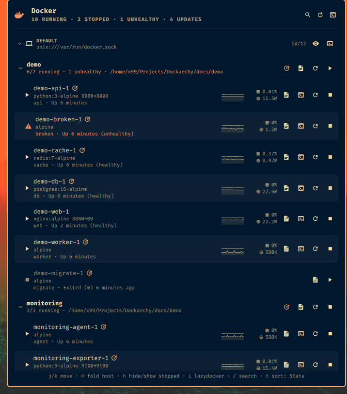

# Dockarchy

Docker (and Podman) container status in the [Omarchy](https://omarchy.org)
bar — for the local daemon *and* your remote servers, in one popup.

Every host is a plain **Docker context**. The local socket is the `default`
context; a remote server is a context with an `ssh://` endpoint. Dockarchy
polls all of them in parallel and shows one section per host, containers
folded under their Compose projects, with CPU and memory per container. Start,
stop, restart, tail logs or open a shell — per container or per project —
search across hosts, and get a desktop notification when something breaks.



## Requirements

- Omarchy 4.x (the Quickshell-based `omarchy-shell`).
- `docker` CLI and `jq` locally; `timeout` and `wl-copy` come with Omarchy.
- Your user must be able to talk to the Docker socket directly. On Omarchy run
  `omarchy setup security sudoless-docker`, then log out and back in.
  No sudo or pkexec is required: the plugin never elevates privileges.
- Optional: `lazydocker` for the terminal buttons on the header, host headers and bar icon.
- For remote hosts: `ssh <host>` must work non-interactively (keys,
  `~/.ssh/config`), and your remote user must be able to run `docker`.

## Install

```bash
omarchy plugin add https://github.com/XNinety9/dockarchy.git --enable
```

Plugins land disabled unless you pass `--enable`; enable later with
`omarchy plugin enable x99.dockarchy`. To place it somewhere specific:

```bash
omarchy bar move x99.dockarchy --before omarchy.network
```

Manual install works too: copy the folder to
`~/.config/omarchy/plugins/x99.dockarchy/`, run `omarchy-shell shell rescanPlugins`,
then `omarchy plugin enable x99.dockarchy`.

The plugin only reads: it never writes outside its own settings entry, which
Omarchy manages in `~/.config/omarchy/shell.json` when you change a setting.

## Uninstall

```bash
omarchy plugin remove x99.dockarchy
```

This deletes `~/.config/omarchy/plugins/x99.dockarchy/` and drops the widget
from the bar. Docker contexts you created (`docker context ls`) and any
`~/.ssh/config` entries are yours and are left untouched; remove a context with
`docker context rm <name>` if you no longer want it.

## Adding a remote server

```bash
docker context create mainserv --docker "host=ssh://x99@mainserv"
docker --context mainserv ps        # one-off sanity check
```

That is all — the widget picks the new context up on its next poll. Remove a
host with `docker context rm mainserv`.

### Podman

Podman has no contexts, so its hosts are listed in the `podmanHosts` setting:
`local` for this machine, `user@host` or `user@host:port` for podman over
ssh (your `~/.ssh/config` applies). They show up as hosts named `podman` and
`podman@host`, with the same rows, stats, actions and update checks — the
collector runs `podman ps/stats --format json` on the host and reshapes it,
and actions use `podman` (locally or through ssh). `podman compose` is used
for project actions; lazydocker is docker-only and hidden for podman hosts.

```bash
omarchy bar set x99.dockarchy podmanHosts "local,me@podbox"
```

### How remote polling works (and why it matters)

`docker --context ssh://…` opens **one SSH session per API call**. That is
fine for a single `docker ps`, but `docker stats` opens one session *per
container*, in parallel — enough to exceed sshd's `MaxSessions`, look like a
brute-force attempt, and get your IP banned by fail2ban.

Dockarchy therefore never polls through `docker --context`. Each poll runs a
single `ssh <host> bash -s` that executes `docker ps` and `docker stats` **on
the server** and streams one result back. Add connection multiplexing to
`~/.ssh/config` so even that one session is reused between polls:

```
Host mainserv
  ControlMaster auto
  ControlPath ~/.ssh/sockets/%r@%h-%p
  ControlPersist 10m
  BatchMode yes
```

(`mkdir -m 700 ~/.ssh/sockets` once.) One-shot actions — start, stop, restart,
logs, shell — still go through `docker --context`, which is a single request.

## Interactions

### Bar icon

| Button | Action                                   |
|--------|------------------------------------------|
| Left   | Open / close the panel                   |
| Right  | Open lazydocker (default context)        |
| Middle | Refresh now                              |

### Panel

| Target        | Mouse                                                                  |
|---------------|------------------------------------------------------------------------|
| Header        | Search · refresh · lazydocker buttons                                  |
| Host row      | Click to fold/unfold the host · eye button hides/shows its stopped containers · lazydocker |
| Project row   | Click to fold/unfold · buttons: project logs · restart · start/stop all |
| Container row | Buttons: logs · shell · restart · start/stop · middle-click copies the name · **right-click opens the menu** |
| Update badge  | An accent-coloured arrow after the name means a newer image exists in the registry; click it to pull (and recreate, for Compose containers) |
| Port chip     | `8080→80` under the name: click opens `http://<host>:8080` in your browser |
| Stats column  | One line per chosen metric (CPU, memory, network, disk, PIDs) with a sparkline over the last polls; hover for details and min/avg/max over the window |

The **context menu** (right-click or `m`) gathers everything for one container:
open each published port, logs, shell, inspect (`docker inspect | less`),
restart, start/stop, copy name or ID, and *Kill…* / *Remove…* behind a
confirmation.

| Key       | On a container                        | On a project row                 | On a host row            |
|-----------|---------------------------------------|----------------------------------|--------------------------|
| `j` / `k` | Move (across projects and hosts)      | Move                             | Move                     |
| `⏎`       | Start / stop                          | Fold / unfold                    | Fold / unfold the host   |
| `u` / `d` | Start / stop                          | Start / stop every container     | —                        |
| `r`       | Restart                               | Restart the running ones         | —                        |
| `l` / `→` | Tail logs in a terminal               | `docker compose logs -f`         | —                        |
| `s`       | Shell (`bash`, falling back to `sh`)  | —                                | —                        |
| `i`       | Inspect                               | —                                | —                        |
| `o`       | Open the first published port         | —                                | —                        |
| `p`       | Pull the newer image (and recreate, if Compose) | Pull & recreate the whole project | —                  |
| `U`       | Check registries for newer images now | same                             | same                     |
| `m`       | Context menu                          | —                                | —                        |
| `x`       | Kill (running) / remove (stopped), after confirming | —                  | —                        |
| `c`       | Copy the container name               | —                                | —                        |
| `h`       | Hide / show stopped containers of this host | same                       | same                     |
| `z`       | Fold / unfold every project           | same                             | same                     |
| `t`       | Cycle sort: State → Name → CPU → Memory | same                           | same                     |
| `/`       | Search                                | Search                           | Search                   |
| `R`       | Refresh                               | Refresh                          | Refresh                  |
| `L`       | lazydocker for the selected host      | same                             | same                     |
| `Esc`     | Close                                 | Close                            | Close                    |

Folded hosts and projects, hidden-stopped hosts and the sort order are
remembered in the widget's settings entry.

**Search** (`/`): every word you type must match somewhere in the name, image,
project, service, state or status line — `unhealthy` lists the sick ones on
every host, `nginx blog` narrows to a project. `↑`/`↓` move the cursor while
typing, `⏎` returns to the list, `Esc` clears. Hosts without a match are hidden.

The shortcut reminder at the bottom of the panel is always visible and follows
the selected row. Logs and shells open through `omarchy-launch-tui`, so they
use your default terminal; on remote hosts they run over your own `ssh` config.

### Notifications

Dockarchy compares each poll with the previous one and sends a desktop
notification when:

- a container turns **unhealthy** or stops **on its own** — never for a stop,
  restart or start you asked for from the panel or its IPC;
- a host stops answering.

Set `notifications` to `Problems and recoveries` to also hear when a container
is healthy or running again, or a host is back. Health flaps are debounced
(2 min per container), stops 20 s. `Off` disables it.

The icon is the Nerd Font whale with an alert or check badge, rendered by
`assets/render-icons` (ImageMagick) into `~/.cache/dockarchy/` in your current
theme's colours when the shell starts and whenever the theme changes. Without
ImageMagick the pre-rendered PNGs in `assets/` are used instead. Any Nerd Font
works; set `DOCKARCHY_ICON_FONT` to force one.

### Image updates

Every `updateCheckHours` (default 6) Dockarchy compares the digest of each
running container's image with what its registry currently serves for that
tag — one anonymous `HEAD /v2/<repo>/manifests/<tag>` per distinct image, run
**on the host that owns the container** (so the server's network, DNS and
mirrors apply). Results are cached in `~/.cache/dockarchy/updates.json`; `U`
forces a check. Containers whose image is newer in the registry get a badge,
their project row gets a pull button, and the panel summary and `{updates}`
bar placeholder count them.

Pulling runs in a terminal so you see the progress: for Compose containers it
is `cd <project dir> && docker compose pull <service> && docker compose up -d
<service>` (the whole project from the project row); standalone containers are
only pulled, since recreating them needs their original `docker run` flags.
Images built locally or pulled by digest cannot be compared and are skipped.
Docker Hub, ghcr.io, lscr.io, quay.io and any registry using the standard
token flow work; private images needing credentials show as unknown.

### What the colours mean

Running containers use the theme's text colour; stopped ones are dimmed.
Unhealthy, restarting or dead containers, unreachable hosts, CPU or memory
above 80 %, and the bar icon when anything needs attention, use a softened
*warning* tint (the theme's text colour blended with its urgent colour) rather
than a full red. Textual error messages stay in the theme's urgent colour.

## Settings

Settings live in the widget's entry in `~/.config/omarchy/shell.json`
(under `bar.layout.<section>`, the object with `"id": "x99.dockarchy"`). Edit
them there, in the shell's settings UI, or with
`omarchy bar set x99.dockarchy <key> <value>` — every change applies live.

| Key                  | Default     | Meaning                                                            |
|----------------------|-------------|--------------------------------------------------------------------|
| `contexts`           | *(all)*     | Docker contexts to monitor. The settings UI offers a picker; `omarchy bar set` takes `ctx1,ctx2`. |
| `podmanHosts`        | *(none)*    | Podman hosts: `local` and/or `user@host[:port]`, comma-separated. |
| `refreshIntervalSec` | `15`        | Poll interval, 5–3600 s.                                           |
| `timeoutSec`         | `10`        | Per-host limit before it is marked unreachable.                    |
| `showAll`            | `true`      | Include stopped containers (`docker ps -a`).                       |
| `showStats`          | `true`      | CPU % and memory per running container (`docker stats`, about a second extra per poll). |
| `showSparklines`     | `true`      | Trend lines next to the stats. CPU is scaled to 100 %, the others to their own peak. |
| `sparkMetrics`       | `CPU,Memory`| Which metrics to show, one line each: `CPU`, `Memory`, `Network`, `Disk`, `PIDs`. Network and disk are bytes/s between two polls. |
| `sparkSamples`       | `20`        | Polls a sparkline spans (5–240). Window = this × `refreshIntervalSec`, shown in the tooltip. |
| `groupByProject`     | `true`      | Fold containers under their Compose project with project-level actions. |
| `sortBy`             | `State`     | `State` (running first, then name), `Name`, `CPU` or `Memory` (hungriest first). `t` cycles it. |
| `collapsedHosts`, `collapsedGroups`, `hideStoppedHosts` | *(empty)* | Comma-separated lists written by the panel itself as you fold or hide things. |
| `notifications`      | `Problems`  | `Off`, `Problems`, or `Problems and recoveries` — see Notifications above. |
| `updateCheckHours`   | `6`         | Hours between registry checks for newer images; `0` disables. |
| `barFormat`          | `{running}` | Label next to the whale (see below). Empty = icon only.            |
| `panelWidth`         | `700`       | Popup width in px (300–1400).                                      |
| `panelMaxHeight`     | `800`       | The popup grows with its content up to this, then scrolls.        |
| `alternateRows`      | `false`     | Shade every other container row.                                   |
| `runningAccent`      | `false`     | Tint running containers with the theme's accent colour instead of the text colour. |

### Bar label template

`barFormat` is a Python-style format string:

| Placeholder     | Value                                          |
|-----------------|------------------------------------------------|
| `{running}`     | Running containers (aliases `{alive}`, `{up}`) |
| `{stopped}`     | Not running (aliases `{down}`, `{exited}`)     |
| `{total}`       | All containers                                 |
| `{unhealthy}`   | Unhealthy, restarting or dead                  |
| `{unreachable}` | Hosts that did not answer                      |
| `{errors}`      | `{unhealthy}` + `{unreachable}`                |
| `{hosts}`       | Hosts polled                                   |
| `{updates}`     | Containers whose image has a newer version     |

Unknown names are left in place so a typo is visible; `{{` and `}}` give
literal braces.

```bash
omarchy bar set x99.dockarchy barFormat '{running}/{total}'
omarchy bar set x99.dockarchy barFormat '{running} up · {errors} err'
omarchy bar set x99.dockarchy barFormat ''            # icon only
```

## IPC

```bash
omarchy-shell x99.dockarchy toggle | open | close | refresh
omarchy-shell x99.dockarchy status      # "27 running · 1 stopped · 1 unhealthy · 2 hosts"
omarchy-shell x99.dockarchy running     # "27"
omarchy-shell x99.dockarchy action <context> <name|id> <start|stop|restart|pause|unpause|kill|rm>
omarchy-shell x99.dockarchy project <context> <project> <start|stop|restart>
omarchy-shell x99.dockarchy search <text>   # open the panel with a filter
omarchy-shell x99.dockarchy sort <State|Name|CPU|Memory|next>
omarchy-shell x99.dockarchy version
omarchy-shell x99.dockarchy settings    # resolved settings, for debugging
omarchy-shell x99.dockarchy rows        # what the panel currently lists, for debugging
omarchy-shell x99.dockarchy history <context> <name|id>   # the sparkline series
omarchy-shell x99.dockarchy checkUpdates                   # registry check now
omarchy-shell x99.dockarchy updates                        # images with a newer version
```

## Omarchy menu

Add a **Docker** submenu (panel, search, refresh, sort, lazydocker) to the
Omarchy menu with:

```bash
~/.config/omarchy/plugins/x99.dockarchy/bin/dockarchy-menu install   # or: remove
```

It appends a marked block to `~/.config/omarchy/extensions/omarchy-menu.jsonc`
(backup kept next to it) and is only ever run by you. The menu reloads on save.

Handy for a Hyprland keybinding in `~/.config/hypr/bindings.lua`:

```lua
o.bind("SUPER + SHIFT + D", "Docker containers", "omarchy-shell x99.dockarchy toggle")
```

## Layout

```
manifest.json           plugin id, defaults and settings schema
Panel.qml               bar button + popup: rows, cursor, keys, footer
Service.qml             polling, actions, timers, watchdog
Model.js                pure JS parsing, filtering, grouping, diffing — testable with node
assets/                 render-icons (glyphs -> PNG) and fallback renders
test/                   node --test suites and the stub docker/ssh they run against
bin/dockarchy-status    queries every context in parallel (one ssh session per
                        remote host) and prints a single JSON document
bin/dockarchy-contexts  lists context names for the settings picker
bin/dockarchy-menu      adds/removes the Docker submenu in the Omarchy menu
bin/dockarchy-updates   compares image digests with their registries (on each host)
```

`bin/dockarchy-status --all --stats --timeout 5 [ctx ...] | jq .` shows exactly
what the widget sees.

### Tests

```bash
node --test          # or: npm test
```

`test/model.test.mjs` covers the pure logic in `Model.js`; `test/status.test.mjs`
runs the collector against a stub `docker` and `ssh` in `test/stub/`, so the
parallel query, ssh dispatch, stats merge, error and timeout paths are checked
without a daemon. CI runs the same plus shell syntax, manifest and icon checks.

### Demo stack

[`docs/demo/compose.yml`](docs/demo/compose.yml) starts seven throwaway
containers covering every state the widget renders — healthy, running,
unhealthy and exited — grouped under the compose project `demo`:

```bash
docker compose -f docs/demo/compose.yml up -d
docker compose -f docs/demo/compose.yml down
```

## Developing

Settings changes apply live. For QML/JS changes the shell's file watcher does
recreate the widget, but Qt keeps serving the previously compiled type, so run
`omarchy restart shell` to pick code changes up. Follow the shell's log with
`journalctl --user -f -o cat | grep -i dockarchy`.

## Changelog

- **0.8.0** — Podman hosts (`podmanHosts`: local or over ssh) alongside Docker
  contexts, with the same rows, stats, actions and update checks.
- **0.7.0** — image update detection by registry digest, with a badge per
  container, pull & recreate for Compose services and projects, `{updates}`
  in the bar label.
- **0.6.0** — `dockarchy-menu` adds a Docker submenu to the Omarchy menu;
  notification icons are now Nerd Font glyphs rendered in the
  theme's colours; sparklines per running container for a chosen set of metrics
  (CPU, memory, network and disk throughput, PIDs) over a configurable number
  of polls, with min/avg/max in the tooltip; optional accent tint for running
  containers.
- **0.5.0** — clickable port chips and `o`; right-click / `m` context menu with
  inspect, copy ID, kill and remove behind a confirmation (`x`); host rows fold
  and can hide their stopped containers (`h`), remembered across restarts;
  sort by state, name, CPU or memory (`t`).
- **0.4.0** — search across hosts (`/`); containers grouped by Compose project
  with fold and project-wide start/stop/restart/logs; desktop notifications on
  unhealthy, unexpected stop or unreachable host, with recoveries optional;
  test suite and CI.
- **0.3.0** — sticky shortcut footer; configurable panel size, bar label
  template and alternating row shading.
- **0.2.0** — CPU/memory per container; `l` opens logs; softer warning colour;
  remote polling switched to a single SSH session per host.
- **0.1.0** — first release: multi-context status, start/stop/restart, logs,
  shell, keyboard navigation.

## License

[WTFPL](LICENSE) — do what you want with it.
